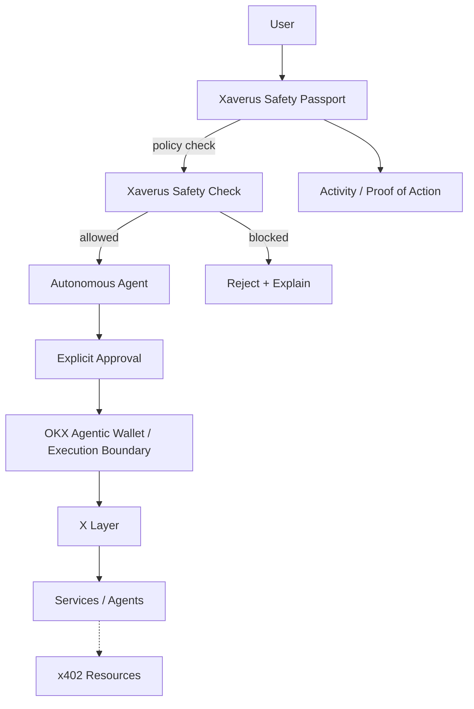

# Xaverus

<div align="center">

**Safe Agent Passport for Autonomous Onchain Agents**

[](https://www.okx.com/xlayer)
[](https://web3.okx.com/)
[](https://nextjs.org/)
[](https://www.typescriptlang.org/)
[](https://www.x402.org/)

**Intent → Safety Passport → Approval → Agent → Wallet → X Layer**

[Live App](https://xaverus.vercel.app) · [Demo](https://youtube.com/watch?v=jTOAmIWEGDs) · [Build Log](BUILD_LOG.md)

</div>

---

## About Xaverus

Xaverus is a **user-controlled safety layer for autonomous onchain agents**.

The agent can plan and coordinate actions, while deterministic policy controls remain between the user's intent and the wallet execution boundary.

### Core idea

> **Let agents act. You keep the keys.**

Xaverus turns agent payment intent into a policy decision before execution.

---

## What Xaverus does

- 🛡️ **Per-transaction spend cap** — limits individual payment intents.
- 📅 **Daily spending cap** — limits cumulative daily spend.
- ✋ **Explicit approval gate** — keeps user approval in the workflow.
- 🛑 **Kill switch** — immediately stops policy-approved actions.
- 🔎 **Intent preview** — exposes the proposed asset, network, amount, and approval requirement.
- 📋 **Activity trail** — records policy decisions and safety actions.
- 🤖 **OKX AI / A2MCP** — exposes Xaverus Safety Check as a machine-readable policy service.
- 💸 **x402 readiness** — includes a server-side x402 seller flow for machine-to-machine paid resources.
- 🧱 **Server-side policy enforcement** — the browser is treated as an untrusted UI.

---

## Live safety behavior

The production safety service has been exercised with three deterministic scenarios:

| Scenario | Policy | Result |
|---|---|---|
| **1 USDC** | Per-tx limit: 5 USDC | **ALLOWED** |
| **6 USDC** | Per-tx limit: 5 USDC | **BLOCKED** |
| **1 USDC + kill switch** | Safety disabled | **BLOCKED** |

The policy service is decision-only. It does **not** sign or move funds.

---

## Why Xaverus

| Capability | Typical agent flow | **Xaverus** |
|---|---|---|
| Spending control | Prompt-level instruction | **Deterministic limits** |
| Daily budget | Often external/manual | **Built into policy** |
| Approval | Agent-dependent | **Explicit approval gate** |
| Emergency stop | Not always available | **Kill switch** |
| Intent visibility | Tool call details | **Intent preview** |
| Auditability | Application logs | **Activity / proof-of-action model** |
| Wallet boundary | Agent may call wallet directly | **Safety layer before execution boundary** |
| Machine service | Custom integration | **OKX AI A2MCP service** |
| Paid machine calls | Optional | **x402 seller flow** |

---

## Architecture



### Security boundary

The browser is treated as an **untrusted UI**.

Secrets and signing material should remain outside client code. Production execution should re-check policy immediately before signing and additionally enforce appropriate simulation, risk, recipient, replay, rate-limit, and audit controls.

Xaverus is designed as **defense-in-depth**, not as a claim of perfect security.

---

## OKX AI integration

Xaverus is registered as an **A2MCP ASP** on X Layer mainnet.

| Field | Value |
|---|---|
| ASP | **Xaverus** |
| Agent ID | **13805** |
| Role | **ASP** |
| Chain | **X Layer mainnet · 196** |
| Service | **Xaverus Safety Check** |
| Service type | **A2MCP** |
| Service ID | `010e5352-7c1a-4d10-a655-93eb2e77611d` |
| Fee | **0 USDT** |
| Endpoint | `/api/agent/safety-check` |
| Listing state | **Under review** |
| A2A communication | **Online / ready** |

> The listing is currently under review. Xaverus does not represent the ASP as approved or listed.

### Safety Check request

```json
{
  "amount": 1,
  "spentToday": 0,
  "policy": {
    "perTx": 5,
    "daily": 25,
    "approvalRequired": true,
    "autoStop": true,
    "enabled": true
  }
}
```

---

## x402 integration

Xaverus includes an OKX x402 seller service:

```
https://xaverus.vercel.app/api/x402/service
```

The seller uses server-only configuration and was validated through an Agentic Wallet payment flow on **X Layer Testnet**.

See [docs/X402_INTEGRATION.md](docs/X402_INTEGRATION.md).

---

## Product flow

```text
Discover Agent
      ↓
Open Agent
      ↓
Configure Safety Passport
      ↓
Preview Intent
      ↓
Policy Check
      ↓
ALLOW / BLOCK
      ↓
Explicit Approval
      ↓
Wallet / Execution Boundary
      ↓
Activity Record
```

The marketplace UI includes:

- Marketplace
- Agent detail
- My Agents
- Safety Passport
- Activity
- Launch Pass concept

---

## API surfaces

| Method | Path | Purpose |
|---|---|---|
| POST | `/api/agent/safety-check` | Server-side safety policy decision |
| GET | `/api/agent/manifest` | A2MCP service manifest |
| GET | `/api/x402/service` | x402-protected service |
| GET | `/api/launch-pass` | Launch Pass status / configuration boundary |

The Launch Pass payment route is intentionally **not enabled** in the current production deployment until its x402 activation path is revalidated against the installed SDK.

---

## Project structure

```text
xaverus/
├── app/
│   ├── agents/              # My Agents
│   ├── activity/            # Activity / audit view
│   ├── safety/              # Safety Passport
│   └── api/
│       ├── agent/            # OKX AI safety service
│       ├── x402/             # x402 seller
│       └── launch-pass/      # Launch Pass boundary
├── lib/
│   └── safety.ts             # Deterministic policy engine
├── scripts/
│   └── x402-e2e-test.mjs     # x402 buyer probe
├── docs/
│   ├── ARCHITECTURE.md
│   ├── OKX_INTEGRATION.md
│   └── X402_INTEGRATION.md
├── BUILD_LOG.md
└── README.md
```

---

## Quick start

```bash
git clone https://github.com/wadezigh96/Xaverus.git
cd Xaverus
npm install
npm run dev
```

Open:

```
http://localhost:3000
```

---

## Build evidence

Xaverus was extended during the official OKX Dev Day build period with meaningful functionality including:

- OKX AI A2MCP service registration
- X Layer mainnet service configuration
- Server-side safety policy endpoint
- x402 seller integration
- x402 buyer E2E probe
- configurable x402 network support
- production diagnostics
- marketplace and Safety Passport UI
- build-period documentation and evidence

See [BUILD_LOG.md](BUILD_LOG.md) and the [commit history](https://github.com/wadezigh96/Xaverus/commits/main/).

---

## Submission

**OKX Dev Day 2026 · Build a Company**

- Repository: [github.com/wadezigh96/Xaverus](https://github.com/wadezigh96/Xaverus)
- Live product: [xaverus.vercel.app](https://xaverus.vercel.app)
- Demo: [YouTube](https://youtube.com/watch?v=jTOAmIWEGDs)
- OKX AI service: **Xaverus Safety Check**
- A2MCP ASP: **13805 · under review**
- Demo duration: **3 minutes**

---

<div align="center">

**XAVERUS**

*Let agents act. You keep the keys.*

[Live](https://xaverus.vercel.app) · [GitHub](https://github.com/wadezigh96/Xaverus) · [Demo](https://youtube.com/watch?v=jTOAmIWEGDs)

</div>
